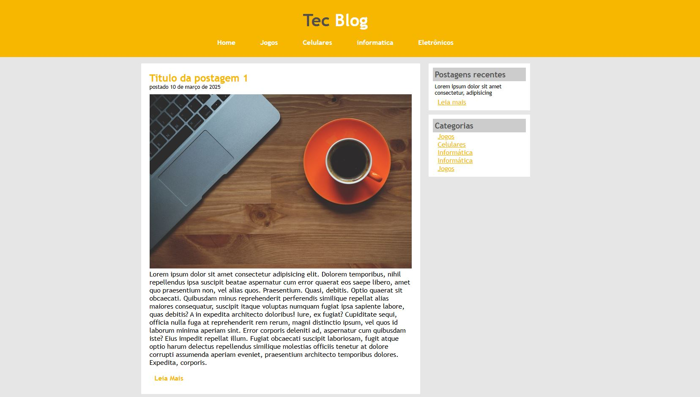

# 📰 Tec Blog

Projeto de uma página de blog desenvolvida com HTML e CSS, com foco em temas relacionados à tecnologia. A página apresenta um layout simples e moderno, com navegação entre categorias como **Jogos**, **Celulares**, **Informática** e **Eletrônicos**.

## 📌 Funcionalidades

- Menu de navegação fixo no topo  
- Seção de postagens com título, imagem, conteúdo e botão "Leia Mais"  
- Barra lateral com postagens recentes e categorias  
- Layout responsivo e limpo, ideal para iniciantes em desenvolvimento web

## 🛠️ Tecnologias utilizadas

- HTML5  
- CSS3

## 💡 Objetivo

Este projeto tem como finalidade praticar a estruturação de páginas web utilizando apenas HTML e CSS, explorando o posicionamento de elementos, organização de conteúdo e design visual.

[Visual da página](PAGINA.JPG)
